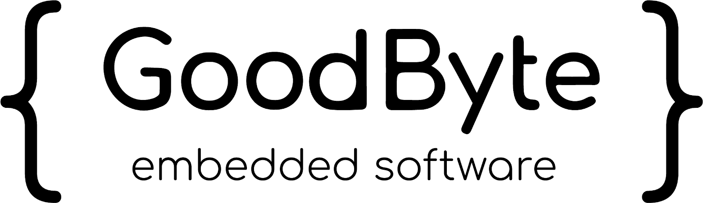

Goodbyte devcontainers features repository
##########################################

Features list
=============

- **NCS_toolchain**

- **JLink**

- **CodeChecker**

- **Dev-dependencies**

NCS_toolchain
*************

The NCS_toolchain feature installs the complete zephyr dependencies required for developing applications within the Nordic Semiconductor ecosystem (NCS). It sets up all necessary tools and dependencies for building and debugging software for Nordic microcontrollers, streamlining the setup process for developers.

JLink
*************

The JLink feature integrates SEGGER J-Link debugging tools into the development environment. It provides support for debugging and programming embedded systems, specifically enabling advanced capabilities for Nordic Semiconductor microcontrollers and other ARM-based devices. This feature ensures that the JLink software, including utilities like JFlashExe, is available and correctly configured for seamless debugging and flashing of firmware.

CodeChecker
*************

CodeChecker is a tool designed for static code analysis, helping developers identify potential bugs, style issues, or vulnerabilities in their projects. It integrates into development workflows to enhance code quality and maintainability.

dev-dependencies
****************

Dev-dependencies is a package designed to extend the common-utils feature for the Zephyr development environment. It provides additional tools and libraries essential for development and testing. This package serves as a foundational ("Low Layer") component to support the creation of more advanced features, ensuring a robust and streamlined development workflow for complex applications.

References
==========

`<https://github.com/devcontainers/feature-starter>`_

`<https://docs.nordicsemi.com/bundle/ncs-latest/page/nrf/installation/install_ncs.html>`_

`<https://github.com/teslamotors/devcontainers-cli/blob/main/docs/features/test.md>`_

📜 License
This project is licensed under MIT Licence same as the original project.

